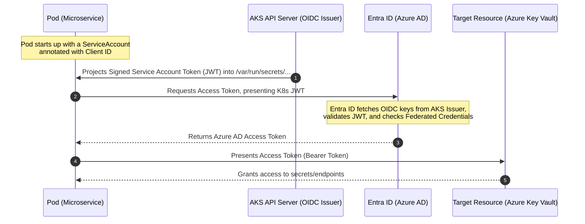

# Entra ID Managed Identities & Federated Credentials in CogniDispatch

This document provides a comprehensive technical overview and architectural deep-dive into the secure identity and access management system implemented across the **CogniDispatch** microservices.

---

## 1. What are Managed Identities and Federated Credentials?

### What is a User-Assigned Managed Identity?
In Microsoft Entra ID (formerly Azure Active Directory), a **Managed Identity** is an automatically managed service principal (identity) created for cloud applications. A **User-Assigned Managed Identity** is created as a standalone Azure resource, has its own lifecycle, and can be shared across multiple resources (e.g., Kubernetes pods, Virtual Machines, or App Gateways).

### What are Federated Credentials (Workload Identity)?
**Workload Identity** is the mechanism by which workloads running on Kubernetes (AKS) authenticate with Azure services without using static credentials (such as client secrets, passwords, or certificates). 
It relies on **Federated Identity Credentials** to establish a trust relationship between **Microsoft Entra ID** and your AKS cluster's **OpenID Connect (OIDC) Issuer**.

---

## 2. Why Do We Use It? (Security & Compliance)
* **Zero Static Secrets:** Hardcoding access keys or client secrets in container configurations, environment variables, or Git repositories creates massive security risks. Workload Identity completely eliminates this.
* **Least Privilege Access:** Permissions are attached to a specific Managed Identity. Pods only get the exact permissions they need (e.g., reading secrets from Key Vault) rather than sharing wide-scoped credentials.
* **Automatic Rotation:** Azure handles token generation, rotation, and lifecycle management automatically. There are no static credentials that expire or need manual rotation.

---

## 3. How Workload Identity Works (Under the Hood)

Below is the step-by-step token exchange flow that occurs whenever a pod requests access to an Azure resource:



1. **ServiceAccount Annotation:** A Kubernetes pod is assigned a `ServiceAccount` annotated with the Azure Client ID of the User-Assigned Managed Identity.
2. **Token Projection:** When the pod starts, the AKS token projection controller injects a signed service account token (JWT) into the pod at `/var/run/secrets/azure/tokens/azure-identity-token` and sets standard environment variables (`AZURE_CLIENT_ID`, `AZURE_TENANT_ID`, `AZURE_AUTHORITY_HOST`, and `AZURE_FEDERATED_TOKEN_FILE`).
3. **Token Exchange:** The Azure SDK (or Secrets Store CSI driver) in the pod reads the projected token and calls the Entra ID token endpoint, presenting the Kubernetes service account token.
4. **Validation:** Entra ID validates the token using the OIDC public keys published by the AKS cluster OIDC issuer URL. It verifies that the namespace and service account name match the configured **Federated Identity Credential**.
5. **Access Granted:** Entra ID exchanges the Kubernetes token for an Azure AD Access Token and returns it to the pod.
6. **Resource Access:** The pod uses this Access Token to securely call Azure services (e.g., Azure Key Vault).

---

## 4. Implementation in the CogniDispatch Project

The workload identity and IAM architecture in CogniDispatch is declared in the Terraform configuration and mapped to the Helm template deployments.

### A. The Infrastructure Layer (Terraform)
Located in: [modules/security/main.tf](file:///d:/Final%20Project%20Devops/cognidispatch-terraform/modules/security/main.tf)

1. **Managed Identity Creation:**
   ```hcl
   resource "azurerm_user_assigned_identity" "pod_identity" {
     name                = "cogni-pod-identity"
     location            = var.location
     resource_group_name = var.resource_group_name
   }
   ```
2. **Access Policy Definition:**
   Grees permissions to the managed identity to fetch and list secrets from the Key Vault:
   ```hcl
   resource "azurerm_key_vault_access_policy" "pod_kv_policy" {
     key_vault_id = var.key_vault_id
     tenant_id    = azurerm_user_assigned_identity.pod_identity.tenant_id
     object_id    = azurerm_user_assigned_identity.pod_identity.principal_id
     secret_permissions = ["Get", "List"]
   }
   ```
3. **Federated Credentials Mapping:**
   A dynamic loop sets up federated credentials for each microservice in both development and production namespaces:
   ```hcl
   locals {
     service_accounts = [
       "admin-service-sa", "ai-service-sa", "auth-service-sa",
       "dispatch-service-sa", "payment-service-sa", "vendor-service-sa", "frontend-sa"
     ]
     namespaces = ["cogni-dev", "cogni-dispatch"]
     # Multiplies namespaces * service_accounts to generate unique pairs
   }

   resource "azurerm_federated_identity_credential" "fed_cred" {
     for_each            = local.fed_creds
     name                = "fed-cred-${each.key}"
     resource_group_name = var.resource_group_name
     audience            = ["api://AzureADTokenExchange"]
     issuer              = var.aks_oidc_issuer_url
     parent_id           = azurerm_user_assigned_identity.pod_identity.id
     subject             = "system:serviceaccount:${each.value.namespace}:${each.value.service_account}"
   }
   ```

---

### B. The Deployment Layer (Helm Templates)
Located in: `cognidispatch-helm/templates/templates/`

Each microservice deployment template (e.g., [ai-service.yaml](file:///d:/Final%20Project%20Devops/cognidispatch-helm/templates/templates/ai-service.yaml) or [dispatch-service.yaml](file:///d:/Final%20Project%20Devops/cognidispatch-helm/templates/templates/dispatch-service.yaml)) configures its identity properties:

1. **Creates a ServiceAccount** annotated with the client ID of the managed identity:
   ```yaml
   apiVersion: v1
   kind: ServiceAccount
   metadata:
     name: ai-service-sa
     annotations:
       azure.workload.identity/client-id: {{ .Values.keyvault.clientId | quote }}
   ```
2. **Associates the Deployment with Workload Identity:**
   ```yaml
   apiVersion: apps/v1
   kind: Deployment
   metadata:
     labels:
       azure.workload.identity/use: "true"
   spec:
     template:
       metadata:
         labels:
           azure.workload.identity/use: "true"
       spec:
         serviceAccountName: ai-service-sa
   ```

---

### C. The Secrets Store CSI Driver
The microservices do not connect to Azure Key Vault directly to retrieve secrets during code execution. Instead, the **Secrets Store CSI Driver** acts as a bridge:

1. It runs as a daemonset on AKS and reads the [secretproviderclass.yaml](file:///d:/Final%20Project%20Devops/cognidispatch-helm/templates/templates/secretproviderclass.yaml) configuration.
2. When a pod is scheduled, the CSI driver uses the pod's `ServiceAccount` and federated workload identity to request the secrets listed (e.g. `MONGODB-URI`, `AZURE-OPENAI-KEY`, `AZURE-SPEECH-KEY`, `SERVICEBUS-CONNECTION`) from Key Vault.
3. The secrets are mounted as a memory-only directory (`/mnt/secrets/`) inside the pod.
4. It also synchronizes them to Kubernetes Secret objects (e.g., `cogni-secrets`), which can then be injected as environment variables (like `SERVICEBUS_CONNECTION`).

---

## 5. Other IAM Role Assignments in the Project

Beyond workload identity, several security and deployment roles are established in the Terraform configuration:

| Role Name | Assignee | Scope | Purpose |
| :--- | :--- | :--- | :--- |
| **AcrPull** | AKS Kubelet Managed Identity | Azure Container Registry (ACR) | Allows AKS worker nodes to authenticate and pull container images from your private registry. |
| **Azure Kubernetes Service Cluster Admin Role** | Jumpbox VM System Identity | AKS Cluster | Grants administrative control to execute `kubectl` management commands from the jumpbox VM. |
| **AcrPush** | Jumpbox VM System Identity | Azure Container Registry (ACR) | Allows building and pushing application container images from the jumpbox to the registry. |
| **Network Contributor** | Jumpbox VM System Identity | Application Gateway & Subnet | Enables ingress path routing updates and backend pool modifications. |
| **AcrPush** | GitHub Actions Service Principal | Azure Container Registry (ACR) | Allows automated CI/CD workflows to push images to ACR during delivery cycles. |
